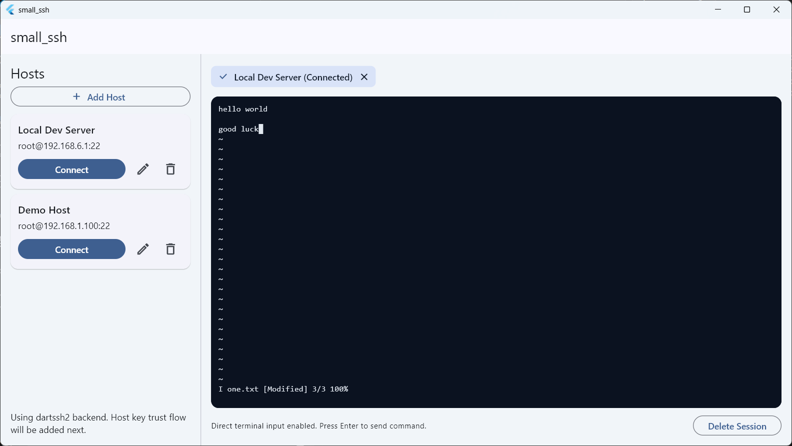

# small_ssh

`small_ssh` 是一个基于 Flutter 的轻量 SSH 客户端示例项目，支持多会话管理、主机配置管理，以及基于 `xterm` 的终端交互体验。



## 功能特性

- 主机配置管理：新增、编辑、删除主机
- 多会话标签：可切换会话并单独删除会话
- 终端交互：使用 `xterm` 渲染终端界面，支持常见控制输入
- SSH 连接：基于 `dartssh2` 建立真实 SSH 会话
- 本地持久化：主机配置保存为可执行文件目录下的 `hosts.json`

## 技术栈

- Flutter
- Dart
- `dartssh2`
- `xterm`

## 快速开始

1. 安装 Flutter 环境（建议使用稳定版）。
2. 拉取依赖：

```bash
flutter pub get
```

3. 启动应用（Windows 示例）：

```bash
flutter run -d windows
```

## 主机配置持久化

应用会将主机配置写入可执行文件所在目录的 `hosts.json`。  
例如在开发模式下，Windows 通常位于：

`build/windows/x64/runner/Debug/hosts.json`

## 项目结构（简要）

- `lib/app`：应用入口与依赖组装
- `lib/presentation`：页面与组件（含终端面板）
- `lib/application`：会话编排与用例逻辑
- `lib/infrastructure`：SSH 网关与持久化实现
- `lib/domain`：领域模型与仓储接口

## 说明

当前项目中的凭据仓储仍为内存实现，重启后密码不会保留；主机配置会持久化到本地文件。
